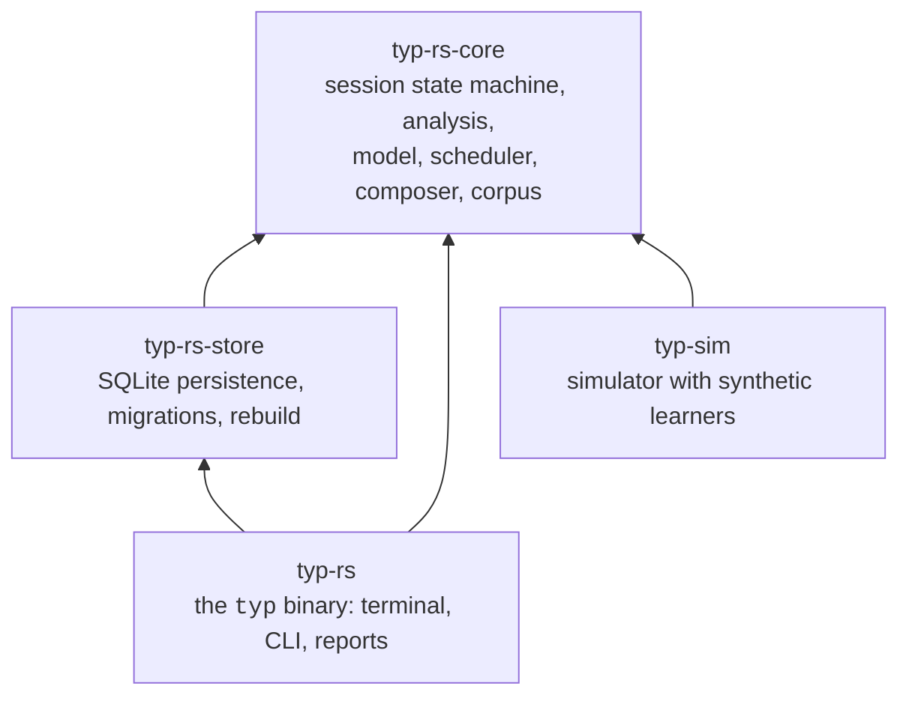
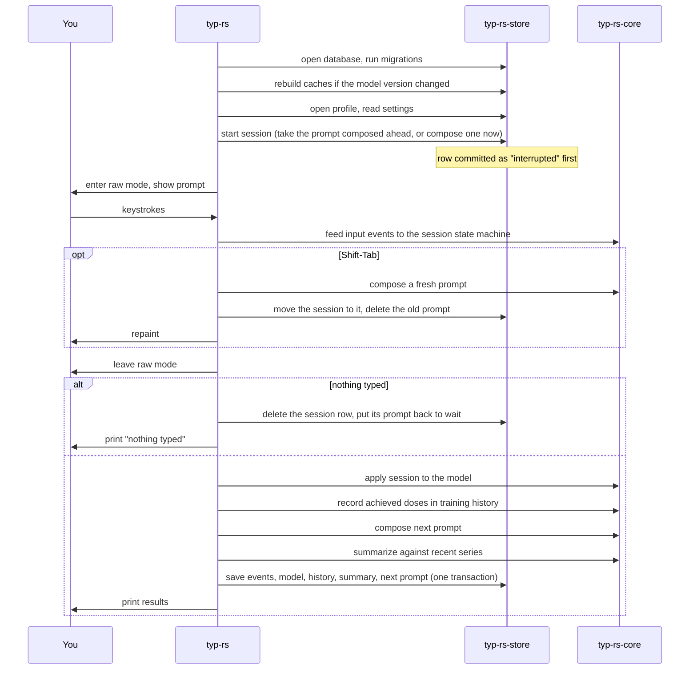

# Architecture

How the workspace is split, what happens on each run, and what is stored.
For the algorithm itself see [`how-it-works.md`](how-it-works.md).

## Crates

| Crate | Depends on | Notes |
| --- | --- | --- |
| `typ-rs-core` | `rand_chacha`, `unicode-width` | Pure logic. No terminal, no database, no clock: every function takes the time as an argument. Everything is deterministic given a seed. |
| `typ-rs-store` | `rusqlite`, core | The only crate that knows about SQLite. Owns the schema and the rebuild. |
| `typ-rs` | `crossterm`, `clap`, core, store | Raw-mode terminal loop, argument parsing, and the text of every report. Published as `typ-rs`, installs as `typ`. |
| `typ-sim` | core | Never published. Drives the same pipeline the binary does with fake typists whose true weaknesses are known. See [`simulator.md`](simulator.md). |

The split lets the analysis and scheduling be tested without a terminal or a
database, and lets the simulator reuse them without re-implementing anything.

### Inside `typ-rs-core`

| Module | Responsibility |
| --- | --- |
| `corpus` | The bundled word list, pattern frequencies over it, the reference distribution and its fixed 1,000-word sample. |
| `prompt` | A prompt as a sequence of words; slots and the pattern ending at each. |
| `session` | The state machine fed by input events: which word, which position, what was typed, editing rules (backspace, extras, re-entry). Produces the event log. |
| `analysis` | From a finished session: first attempts, error alignment and attribution, interval classification, session metrics. |
| `model` | Per-pattern decaying statistics, estimates with shrinkage, the context model, the weakness score, the difficulty adjustment. |
| `scheduler` | Target selection, deferral, exploration, plateau; training history; achieved doses. |
| `compose` | Word selection, probes, contamination, arrangement. |
| `metrics` | Session summaries, recent series, probe trends, transfer. |
| `layout` | Key geometry per layout (finger, hand, row, position). |
| `display` | Wraps a session into styled cells and a caret position; the color palette and `NO_COLOR` handling; the cursor shapes. |
| `random` | A seeded ChaCha PRNG so every draw is reproducible. |

## A run of `typ`

Three things about this order are deliberate.

**The database is never touched while you type.** The session row is written
before raw mode and the events after it. Nothing runs in the background
during a session, and a crash mid-session still leaves a row marked
interrupted. The one exception is a restart, which is a moment when nothing
is being typed: the fresh prompt is composed from the model and history
loaded at startup (nothing has changed them) and written in one short
transaction before it is painted.

**Only sessions are recorded.** An attempt becomes a session at its first
typed character. Restarting or leaving before that discards the attempt:
its row is removed, and nothing about it reaches the model, the training
history, or the deferral windows, which are all built from ended sessions.
A prompt left untyped goes back to being the profile's waiting prompt, so
the next run shows it again; a prompt restarted away from is deleted.

**The next prompt is composed at the end of this session, not at the start
of the next.** Composition takes tens of milliseconds and you are already
waiting for results; doing it then keeps startup instant. The waiting prompt
records what it was composed for (word count, corpus version, model version,
layout); if the next run does not match, it is discarded and a fresh one
composed on the spot.

The end-of-session steps have a budget of 100 ms in total; the simulator's
integration tests assert it.

## What is stored

One SQLite file, `typ.db`, under the data directory. Tables fall into two
groups.

### Source of truth

Written once and never changed, once a session has ended. While an attempt
is in flight its row may still move: a restart repoints it at a freshly
composed prompt and deletes the prompt it was showing, and leaving it
untyped deletes the row itself.

| Table | Holds |
| --- | --- |
| `profiles` | Name, layout, when created. |
| `settings` | Per-profile settings (`words`) and the whole-database ones: the active profile, the cursor shape and blink. |
| `prompts` | Every prompt a session showed or is waiting to show: when it was composed, under which corpus version, how many words. |
| `prompt_words` | Each word of each prompt: text, role (targeted or probe), exposed targets, selection score, contamination. |
| `prompt_targets` | Each pattern selected for a prompt: role (target, deferred, explore), weakness mean and sd, priority, planned dose. |
| `sessions` | Start and end time, outcome, seed, the semantics version and config it ran under, and which model version has applied it. |
| `input_events` | Every decoded terminal input with its timestamp and flags (burst, paste, after resize, first of session, long pause). |

### Caches

Derived from the tables above. Every row is stamped with the model version
that produced it.

| Table | Holds |
| --- | --- |
| `pattern_stats` | The decaying sums for every pattern of every profile. |
| `context_model` | The fitted context coefficients and how many completed sessions have been applied. |
| `pattern_training_events` | What each selected target achieved in its session: the training history the scheduler reads. |
| `session_metrics` | Each completed session's summary: gross WPM, standard-text WPM, the recent series with it included, probe figures. |
| `next_prompt` | The prompt waiting for each profile's next session: the one composed ahead at the last session's end, or one put back by an attempt left untyped. |

### Rebuild

`typ rebuild` drops every cache and replays every stored session through the
current pipeline in order, in one transaction. The same thing happens
automatically on startup when any cache row carries a model version other
than the current one. Startup also applies any session that ended but was
never applied (the process died between the session and the save), so a
crash costs at most the results printout.

This is why the model must be a pure function of the stored sessions: the
context model is refitted at fixed points in the sequence (every fifth
completed session) and nowhere else, all randomness is seeded, and every
"now" is the session's stored timestamp. Applying the same sessions to an
empty model reproduces the cache byte for byte. `typ replay <id> --diff`
checks exactly this for one session.

### Versions

Three independent version numbers are recorded so that old data stays
interpretable.

| Version | Bumped when | Effect |
| --- | --- | --- |
| corpus | the word list or its filter rules change | The reference sample changes; a waiting prompt composed under the old corpus is discarded. |
| semantics | the session's editing rules change (what backspace does, how extras are capped, ...) | Stored events are replayed under the rules they were typed with. |
| model | anything feeding a cache changes | Every cache is rebuilt on next start. |

## The terminal loop

`crates/typ-rs/src/`:

| File | Responsibility |
| --- | --- |
| `main.rs` | Argument parsing, the subcommands, the start and end of a session. |
| `terminal.rs` | Raw mode guard. Sets the cursor shape; restores the terminal, cursor included, on every exit path, panics included. |
| `input.rs` | Decodes terminal events into input events; flags bursts, pastes, resizes. |
| `render.rs` | Paints the prompt; repaints only changed cells; re-wraps on resize; rests the hardware cursor on the caret. |
| `interactive.rs` | The loop that ties input, state machine, and rendering together. |
| `report.rs` | The text of every report: results, `stats`, `replay`. |

The painter's output is unit tested against the exact escape sequences it
emits, but raw mode, the real terminal's response to them, and restoration
on exit are not. Run through [`smoke-test.md`](smoke-test.md) after changing
any of it.

## Environment variables

| Variable | Effect |
| --- | --- |
| `TYP_DATA_DIR` | Directory for `typ.db`. Without it, an optimized build uses the platform data directory and a debug build `target/typ-data` in its source tree, so developing never touches an installation's data. |
| `NO_COLOR` | Bold and underline instead of color. |
| `TYP_DIAGNOSTICS` | Print render timing per input batch to stderr after the results. |
| `TYP_PANIC_AFTER=n` | Panic after `n` keystrokes, to test terminal restoration. Debug builds only. |
