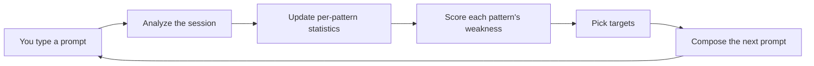
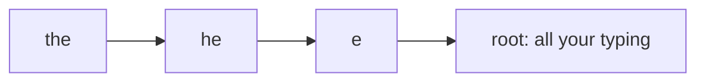
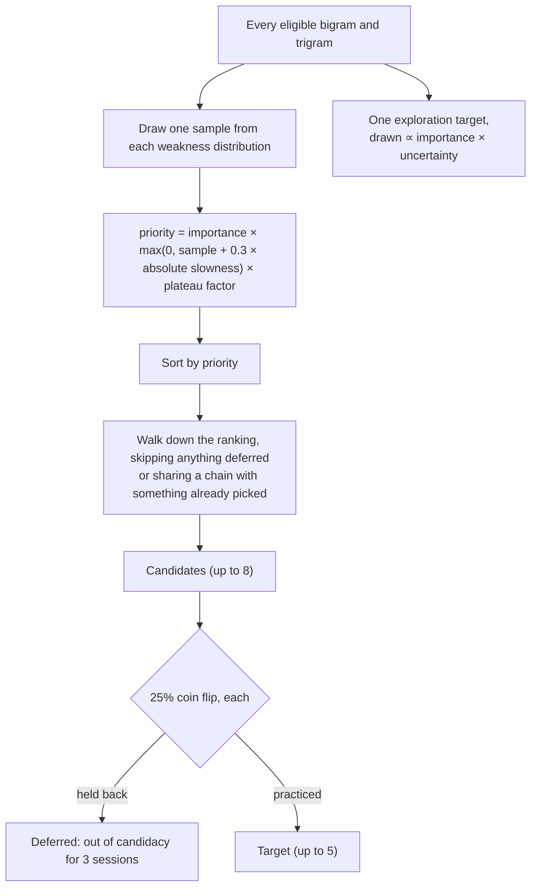
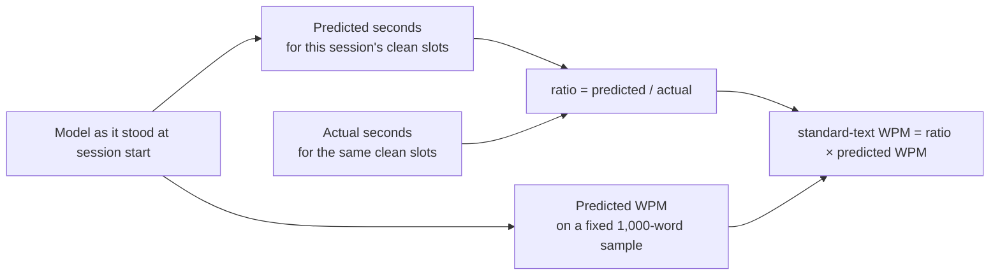

# How typ decides what you practice

This is the path from the keystrokes of one session to the prompt of the
next. Every number below is a default; the full list is at the end.



## 1. What is measured

### Slots and patterns

A prompt is a sequence of **slots**, one per character you are expected to
type, spaces included. Every measurement is about a slot.

Each slot has a **pattern**: the character at the slot together with up to
two preceding characters. Space is an ordinary character, so word beginnings
and endings are patterns too. For the word `the` following a space:

| Slot | Character | Bigram | Trigram |
| --- | --- | --- | --- |
| 1 | `t` | `␣t` | `e␣t` (if the previous word ended in `e`) |
| 2 | `h` | `th` | `␣th` |
| 3 | `e` | `he` | `the` |
| 4 | `␣` | `e␣` | `he␣` |

`␣th` means "the `th` that starts a word", `he␣` means "the `he` that ends
one". Those are often typed differently from the same letters mid-word, and
typ can tell them apart.

The three levels form a **back-off chain**. `the` backs off to `he`, which
backs off to `e`, which backs off to the root: you as a whole.



An observation at a slot updates every level of its chain at once. This is
what lets typ have an opinion about a trigram it has seen twice: it borrows
from the bigram, which borrows from the character.

### Speed: which keystrokes count

The speed signal is the **incoming latency**: the time from the previous
keystroke to this one. But not every interval says something about how fast
your fingers move. An interval is **clean** only when none of these apply:

| Excluded when | Why |
| --- | --- |
| first keystroke of the session | no previous keystroke |
| backspace, or retyping a corrected position | correction, not typing |
| the keystroke right after a correction | you were re-orienting |
| after an uncorrected error earlier in the word | you were typing off the rails |
| pasted, or right after a terminal resize | not a keystroke, or the screen moved |
| arrived in a burst with others | buffered by the terminal, timing meaningless |
| longer than the hesitation threshold: 4× your typical clean latency, and at least 1.5 s | a **hesitation**: recorded as its own signal on the pattern, not as speed |

Hesitations are not thrown away. "You stall before this pattern" is one of
the four things that make a pattern weak (section 4).

### Accuracy: first attempts only

Backspace lets you fix anything, so the accuracy that matters is your
**first attempt** at each character. When you leave a word, typ freezes what
you had typed at each position before any backspace, aligns it to the target
word (edit distance with transpositions), and attributes each error to the
pattern at the slot where it happened. Where several alignments tie, the one
that places errors latest in the word wins; if still tied, blame is split.

**Raw accuracy** is first-attempt correct characters over all characters.
**Final accuracy** is what you submitted after corrections. Raw is the
training signal; final is just reported.

## 2. Per-pattern statistics

Every pattern you have ever typed has a small row of running sums: how many
latency observations, their total and total of squares, how many first
attempts were correct or wrong, how many hesitations. Three things keep these
honest.

**They decay.** Each sum halves every 45 days (7 days for the root, which
tracks your current typical speed). What you did last month matters less than
what you did yesterday.

**Latencies are normalized before they are stored.** A raw latency is not
stored; what is stored is

```
log(latency) − your baseline − this session's offset
```

Your **baseline** is your typical clean log-latency across everything. The
**session offset** is how much faster or slower this particular session was
than usual (median residual, pulled toward zero when there are few
intervals). So a slow day does not make every pattern look weak; it moves the
offset instead. Log scale makes "20% slower" mean the same thing at 40 wpm
and at 120.

**Speed evidence is gated by accuracy.** Each session gets an **accuracy
factor**: zero if raw accuracy is at or below 90%, one from 98%, linear
between. Every latency and hesitation from the session enters the sums
multiplied by it. Typing fast by not caring about mistakes does not register
as speed. (First-attempt outcomes always enter in full.)

### Estimates borrow from the parent

To estimate a pattern's slowness, typ takes its own sums and adds κ = 10
pseudo-observations at the parent's estimate:

```
slowness(the) = (own_sum + 10 × slowness(he)) / (own_count + 10)
```

A pattern with two observations is mostly its parent; one with two hundred is
mostly itself. The same shrinkage applies to error probability, hesitation
rate, and variance. The root's error rate starts at a Beta(1, 19) prior, so a
brand-new profile assumes a 5% error rate until it sees otherwise.

## 3. Awkward or weak? The context model

Some patterns are slow for everyone. `ce` needs the same finger twice on
QWERTY; the first letter of a word carries reading time. A trainer that
targeted those would spend your practice on keyboard geometry.

So every slot also carries a vector of nine **context features**:

| Feature | What it captures |
| --- | --- |
| first of word, last of word | reading and planning at word edges |
| word length, log word frequency | long or rare words are read differently |
| boundary | the bigram straddles a space |
| same finger, same hand | which hand does the work |
| row change, key distance | how far the finger travels on the layout |

From your fifth completed session, and every five after, typ fits a linear
model (ridge regression) from these features to observed slowness, over
every bigram it has evidence for. That model's prediction for a pattern's
typical context is its **context effect**. Whatever slowness remains is the
**pattern effect**:

```
absolute slowness  =  context effect  +  pattern effect
                      (keyboard, word)   (you)
```

The pattern effect is what feeds the weakness score. Absolute slowness still
gets a minority share of the priority (section 5), because a pattern that
costs you time is worth a little practice even if the layout is to blame.

## 4. The weakness score

Each pattern's **weakness** compares it with the root on four axes, all in
log ratios so they are on one scale:

| Component | Weight | Measures |
| --- | --- | --- |
| error excess | 0.50 | `ln(pattern error rate / your error rate)` |
| speed excess | 0.25 | the pattern effect from section 3 |
| inconsistency | 0.10 | `ln(pattern latency spread / your spread)` |
| hesitation excess | 0.15 | `ln(pattern hesitation rate / your hesitation rate)` |

Accuracy carries half the weight on purpose: an error costs far more time
than a slow keystroke.

The weakness is a **distribution**, not a number. Each component's
uncertainty comes from how much evidence backs it, and they are combined into
a mean and a standard deviation. A pattern seen three times can have a high
mean weakness with a wide spread; one seen three hundred times has a narrow
one. `typ stats` shows both (`+0.42 ± 0.18`).

## 5. Picking targets

Only bigrams and trigrams are ever targets (a single character is too coarse
to practice). A pattern is **eligible** if it appears in at least five corpus
words and its **importance** (square root of its frequency in the corpus) is
above a floor. Importance is what makes `th` worth more attention than `xq`.



Some notes on the steps.

**Sampling, not ranking by mean.** Each session draws one value from every
pattern's weakness distribution and ranks on that. A pattern with a wide
uncertainty will sometimes sample high and get tried, which is how typ
discovers weaknesses it has little evidence for. This is Thompson sampling.

**One per chain.** Never both `th` and `ath` in one session: they would be
practiced by the same words and their evidence would be confounded.

**Deferral.** A quarter of candidates are randomly held out for three
sessions. They still appear in prompts at their natural rate; what they do
not get is targeted practice. Comparing how deferred and targeted patterns
move over time is the only way to tell practice from regression to the mean
(a pattern that looked weak because of a bad day would have improved anyway).
`typ stats` lists them under `deferred candidates`.

**Exploration.** One extra pattern per session is drawn in proportion to
importance × uncertainty, ignoring rank. It gets the same dose as a target.
Shown as `(exploring ...)` on the `next:` line.

**Plateau.** A target practiced in four or more sessions with over twenty
exposures, whose weakness mean has moved less than its own uncertainty over
that span, has plateaued. Its priority is halved, recovering linearly over
the next ten sessions it goes untargeted. Practice that is not working makes
room for practice that might.

## 6. Composing the prompt

### How much is targeted

| Completed sessions | Targeted share |
| --- | --- |
| 0 | 0% (a plain baseline) |
| 1 | 30% |
| 2 | 47% |
| 3 | 63% |
| 4 or more | 80% |

The rest are **probes**: words drawn from a fixed frequency-weighted
distribution over the corpus, independent of you. Probes are the yardstick.
They are never filtered, so a word you happen to be practicing can turn up as
a probe; instead typ records that it did (**contamination**: the word or its
patterns were targeted in this prompt or the last ten sessions), so the
reports can separate clean transfer evidence from contaminated.

### Choosing targeted words

Each target has a **dose**: six exposures per prompt. A word exposes a target
once per slot whose chain contains it, but at most twice per word, and a slot
counts toward only the deepest practiced pattern in its chain (a slot whose
trigram is a target does not also count for the bigram).

Words are picked one at a time from a pool (every corpus word containing a
target or the exploration target, plus 200 words drawn from the reference
distribution). Each pick is a softmax draw over a score:

```
score = coverage gain
      + 0.5 × ln(word frequency)
      − 1.0  if the word was targeted in the last 5 sessions
      − 1.0  per target exposed beyond 3 in one word
      − 0.2  per character beyond 10
```

**Coverage gain** is the interesting term. A target's coverage rises as
`1 − exp(−exposures / dose)`, so each additional exposure of a target is
worth less than the last, and a target that has its dose is worth nothing
more. Without this, the hundreds of words containing a common target would
crowd out the few containing a rare one. Coverage is weighted by each
target's priority, and the exploration target counts at least as much as an
average target so it actually gets practiced.

The frequency term keeps the words real. The penalties stop the prompt being
the same ten words every session, stop one word carrying every target, and
keep words typeable.

### Arrangement

Targeted words and probes are shuffled together, then rearranged so that two
words exposing the same target are never adjacent. Drilling one motion in
consecutive words teaches the word, not the motion.

## 7. Knowing whether it works

Targeted prompts are harder than random text by construction, so gross WPM
drops when targeting starts. Several things exist to see through that.

### Speed on standard text



The model already knows how slow each pattern is for you. So it can predict
how long this session's clean slots *should* have taken on a typical day.
The ratio of predicted to actual is how well you typed relative to your own
norm, with the prompt's difficulty canceled out. Applied to the model's
prediction for a fixed 1,000-word sample of ordinary text, that gives the
speed you would have shown on standard material.

It is reported against a recency-weighted average of your recent sessions
(half-life five sessions): `+3 vs recent`. Watch this line, not gross WPM.

### Probes

`typ stats` reports speed and raw accuracy over your last hundred
uncontaminated probe words and compares with the hundred before. The
`sustained improvement` / `sustained decline` marker appears only when the
previous hundred's level falls outside the 95% confidence interval of the
current hundred. Probes are the closest thing to a
controlled measurement: the words were not chosen for you, and they exclude
anything you have recently drilled.

### Transfer

For each recently practiced pattern, `typ stats` shows how you type it in
words that were used to drill it versus words that were not. If the drilled
words got fast and the others did not, you learned the words. If both did,
you learned the pattern.

### Interrupted sessions

An interrupted session keeps its observations if it has at least twenty clean
intervals, but does not count toward the targeting ramp or the recent
averages, and shows no speed: a partial prompt has no meaningful WPM.

## Tunables

Every default, as `typ-sim --list-tunables` prints them. The simulator can
override any of them with `--set name=value`; see
[`simulator.md`](simulator.md) for what the sweeps found.

| Name | Default | Meaning |
| --- | --- | --- |
| `pattern_half_life_days` | 45 | decay of pattern statistics |
| `baseline_half_life_days` | 7 | decay of the root (your typical speed) |
| `kappa` | 10 | pseudo-observations from the parent when estimating |
| `root_prior_errors`, `root_prior_correct` | 1, 19 | Beta prior on error and hesitation rates |
| `latency_variance_prior` | 0.1 | prior variance of log-latency |
| `offset_regularizer` | 20 | pull of the session offset toward zero |
| `interrupted_min_clean_intervals` | 20 | an interrupted session needs this many to count |
| `context_refit_sessions` | 5 | refit the context model every this many completed sessions |
| `context_ridge_lambda` | 1.0 | ridge penalty on the context model |
| `accuracy_gate_zero`, `accuracy_gate_full` | 0.90, 0.98 | raw accuracy where speed evidence counts nothing, and fully |
| `weight_error`, `weight_speed`, `weight_inconsistency`, `weight_hesitation` | 0.50, 0.25, 0.10, 0.15 | weakness components |
| `slowness_share` | 0.3 | share of absolute slowness in the priority |
| `log_ratio_variance_cap` | 1.0 | cap on the uncertainty of a rate ratio |
| `importance_floor`, `min_pattern_words` | 0.005, 5 | eligibility |
| `candidates`, `max_targets` | 8, 5 | ranking walk and target count |
| `deferral_probability`, `deferral_window` | 0.25, 3 | control holdout |
| `dose` | 6 | exposures per target per prompt |
| `plateau_min_sessions`, `plateau_min_dose` | 4, 20 | when a target can be judged plateaued |
| `plateau_factor`, `plateau_recovery_sessions` | 0.5, 10 | how hard and how long it is backed off |
| `ramp_start_share`, `ramp_full_share`, `ramp_sessions` | 0.30, 0.80, 4 | the targeted-share ramp |
| `pool_sample` | 200 | reference words added to the targeted pool |
| `coverage_scale` | 20 | how strongly coverage leads the word score |
| `temperature` | 0.25 | softmax temperature of the word draw |
| `recent_word_sessions`, `recent_word_penalty` | 5, 1.0 | penalty for a recently drilled word |
| `overload_targets`, `overload_penalty` | 3, 1.0 | penalty per extra target stacked in one word |
| `long_word_length`, `length_penalty` | 10, 0.2 | penalty per character over the length |
| `min_exposure_gap` | 2 | minimum spacing of same-target words |
| `contamination_sessions` | 10 | how far back probe contamination looks |
| `recent_half_life_sessions` | 5 | half-life of the "vs recent" average |
